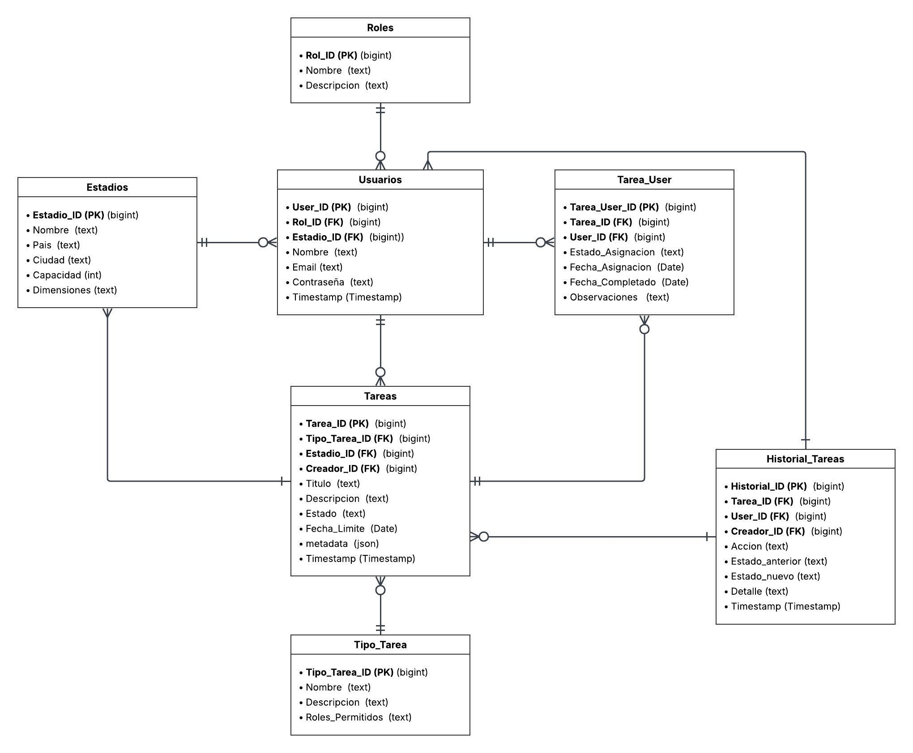

# 🏟️ StadiumHub

Materia: Lenguajes de la Programación | Periodo: 2026-1 | Estado: Completado

> Sistema web de gestión de mantenimiento de césped híbrido para estadios sede de la **FIFA World Cup 2026**.
> Construido con Laravel 11, Bootstrap 5 y MySQL.

---

## Equipo de Trabajo
- [Estudiante 1](https://github.com/raulgaray26)
- [Estudiante 1](https://github.com/danielgomez-spec)

---

## Demostración en Video

https://github.com/user-attachments/assets/c26e8088-13f9-4b4f-a86d-2959acaf9282


## Modelo Relacional de la Base de Datos


---

## Funcionalidad

- [x] **Autenticación por roles:** Login y registro con redirección automática según rol (Comité, Jefe, Técnico). [Commit](https://github.com/raulgaray26/StadiumHub/commit/3e24c78bdde44b4efa45dd7eaa4ff4ee8717645f)
- [x] **Dashboard Técnico:** Visualización de tareas asignadas con fecha límite, estado y marcado de completado. [Commit](https://github.com/raulgaray26/StadiumHub/commit/c14aa5c414d0e6379f7d9cf9d4e84c4790ad1356)
- [x] **Dashboard Jefe:** Creación de tareas, asignación a técnicos del estadio y estadísticas. [Commit](https://github.com/raulgaray26/StadiumHub/commit/ba2803d145e4dc9861428ac43f42a52e319d24f6)
- [x] **Dashboard Comité FIFA:** Auditoría global con historial paginado y estado de todos los estadios. [Commit](https://github.com/raulgaray26/StadiumHub/commit/3d5aea5fdc8009228cd917a8ec6b7de7585db2f3)
- [x] **Protección por Middleware:** Cada sección está protegida por middlewares de rol personalizados.
- [x] **Log de Auditoría:** Cada acción (crear, asignar, completar) queda registrada en `historial_tareas`.

---

## Tecnologías

`PHP 8.2` | `Laravel 11` | `Blade` | `Bootstrap 5.3` | `MySQL` | `XAMPP` | `Git / GitHub`

---

## Ejecución

```bash
# 1. Clonar el repositorio
git clone https://github.com/[EDIT-tu-usuario]/StadiumHub.git
cd StadiumHub

# 2. Instalar dependencias PHP
composer install

# 3. Configurar entorno
cp .env.example .env
php artisan key:generate

# 4. Configurar la base de datos en .env
# DB_DATABASE=stadiumhub
# DB_USERNAME=root
# DB_PASSWORD=
# (La BD ya debe existir en MySQL con las tablas del modelo relacional - se puede encontrar el .sql en docs)

# 5. Levantar servidor de desarrollo
php artisan serve

# Acceder en: http://127.0.0.1:8000
```

> **Requisito:** XAMPP con MySQL activo. La base de datos `stadiumhub` debe existir previamente con las tablas: `roles`, `usuarios`, `estadios`, `tareas`, `tipo_tarea`, `tarea_user`, `historial_tareas`.

---

## Métricas de Progreso

| Indicador | Valor |
|---|---|
| Commits totales | 40 |
| Pull Requests fusionados | 13 |
| Última actualización | 2026-06-14 |

---

## Reflexión y Aprendizajes
> **Reflexión final:** Construir StadiumHub fue un reto que nos sacó de la zona de confort. Pasamos de la teoría a lidiar con problemas reales de lógica y control de versiones, pero ver el sistema funcionando fluido para los tres roles.

- **Habilidades desarrolladas:**
  - Entender a fondo el patrón MVC en Laravel y sacarle provecho a las plantillas Blade.
  - Trabajo colaborativo real con Git, perdiéndole el miedo a la terminal y a resolver conflictos de merge.
  - Diseño ágil de interfaces utilizando las clases de Bootstrap 5 para no estancarnos en el CSS.

- **Qué funcionó bien:**
  - Separar las responsabilidades y el ruteo por roles (Comité, Jefe, Técnico) desde el principio. Nos permitió avanzar en paralelo sin pisarnos el código.

- **Qué se podría mejorar:**
  - Añadir pruebas unitarias para no tener que testear cada vez que hacíamos un cambio.

- **Conceptos clave aplicados de la materia:**
  - Middlewares para la protección de rutas, Eloquent ORM para evitar el SQL puro en relaciones complejas, y el sistema de autenticación de Laravel.
